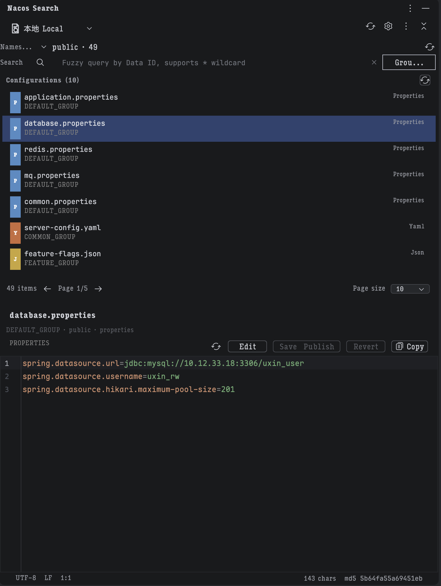
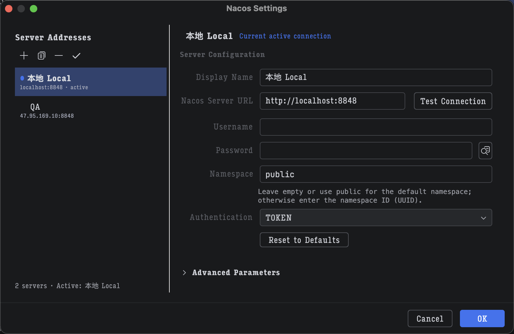

# Nacos Search

Nacos Search 是一个 IntelliJ IDEA 插件，用于在 IDE 内直接连接、搜索和查看 Nacos 配置。它适合需要频繁在多个 Nacos 环境、命名空间和配置项之间切换的开发场景。


## 功能特性

- 多环境连接：在一个插件内维护多个 Nacos 地址，例如本地、测试、预发、生产，并可在工具窗口顶部快速切换。
- 命名空间管理：加载 Nacos namespace，并支持按名称、ID、描述搜索过滤。
- 配置搜索：按 Data ID 搜索配置，支持模糊查询和 `*` 通配符。
- 配置详情：在 IDE 内查看配置内容、Data ID、Group、Namespace、类型、更新时间等信息。
- 分组过滤：按 Group 缩小配置列表范围。
- 分页浏览：适配配置数量较多的 namespace，避免一次性展示过多数据。
- 本地缓存：缓存配置列表和配置详情，减少重复请求，提升常用场景下的响应速度。
- 认证支持：支持 Token、Basic、Hybrid 等认证模式。

## 截图

### 本地 Local 配置详情

用于展示工具窗口中选择 `本地 Local` 环境后，配置列表和配置详情面板的实际效果。建议截图内容包含：

- 顶部环境切换按钮显示 `本地 Local`
- namespace 选择器
- 配置列表
- 选中某个配置后的详情内容
- Data ID、Group、类型、更新时间等元信息



### 配置设置页面

用于展示 `Settings/Preferences -> Tools -> Nacos Search` 的多环境配置页面。建议截图内容包含：

- 左侧服务器地址列表
- 当前活动环境，例如 `本地 Local`
- Nacos Server URL
- Username / Password
- Namespace / Default Group
- Authentication
- Cache / refresh 相关设置



## 安装

1. 打开 IntelliJ IDEA。
2. 进入 `Settings/Preferences -> Plugins -> Marketplace`。
3. 搜索 `Nacos Search`。
4. 安装插件并重启 IDE。

也可以从本项目构建插件包后，通过 `Settings/Preferences -> Plugins -> Install Plugin from Disk...` 安装。

## 快速开始

### 1. 配置 Nacos 环境

打开 `Settings/Preferences -> Tools -> Nacos Search`，在服务器地址列表中维护连接配置。

常见字段说明：

- Display Name：环境显示名称，例如 `本地 Local`、`Test`、`Prod`。
- Nacos Server URL：Nacos 服务地址，例如 `http://localhost:8848`。
- Username / Password：Nacos 认证账号密码，可按需填写。
- Namespace：默认 namespace。公开命名空间可留空或填写 `public`。
- Default Group：默认分组，通常为 `DEFAULT_GROUP`。
- Authentication：选择当前 Nacos 服务需要的认证方式。

### 2. 打开工具窗口

通过 `View -> Tool Windows -> Nacos Search` 打开插件窗口。

工具窗口顶部会展示当前环境。点击环境名称可以在多个 Nacos 连接之间切换。

### 3. 选择 namespace

在 namespace 区域选择目标命名空间。namespace 较多时，可以通过搜索框按名称、ID 或描述过滤。

### 4. 搜索和查看配置

在搜索框输入 Data ID 或通配符表达式，例如：

```text
application
application*
*database
```

点击配置列表中的条目后，右侧详情面板会展示配置内容和元信息。

## 使用建议

- 多环境建议使用明确的 Display Name，例如 `本地 Local`、`测试 Test`、`生产 Prod`。
- 生产环境建议使用只读账号，避免误操作。
- namespace 不确定时，先刷新 namespace 列表，再通过搜索过滤。
- 配置数量较多时，优先使用 Data ID 搜索和 Group 过滤，减少列表翻页成本。
- 如果 Nacos 服务端配置较多，可以开启缓存并设置合理 TTL，降低频繁查询带来的延迟。

## 开发

这是一个使用 Kotlin 和 Gradle 构建的 IntelliJ 平台插件。

### 项目结构

- `src/main/kotlin/com/nanyin/nacos/search/actions`：菜单和工具动作。
- `src/main/kotlin/com/nanyin/nacos/search/listeners`：事件监听器。
- `src/main/kotlin/com/nanyin/nacos/search/managers`：初始化和生命周期管理。
- `src/main/kotlin/com/nanyin/nacos/search/models`：Nacos 配置、namespace、搜索结果等模型。
- `src/main/kotlin/com/nanyin/nacos/search/services`：Nacos API、认证、搜索、缓存、namespace 等核心服务。
- `src/main/kotlin/com/nanyin/nacos/search/settings`：插件配置与设置页。
- `src/main/kotlin/com/nanyin/nacos/search/ui`：工具窗口和 Swing UI 组件。
- `src/main/resources/messages`：中英文国际化文案。

## 许可证

[MIT](LICENSE)