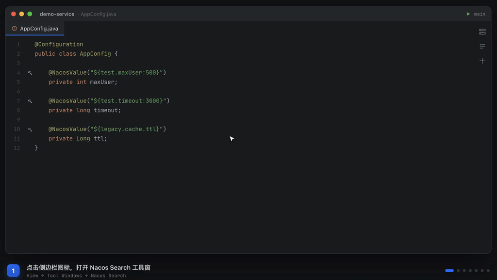
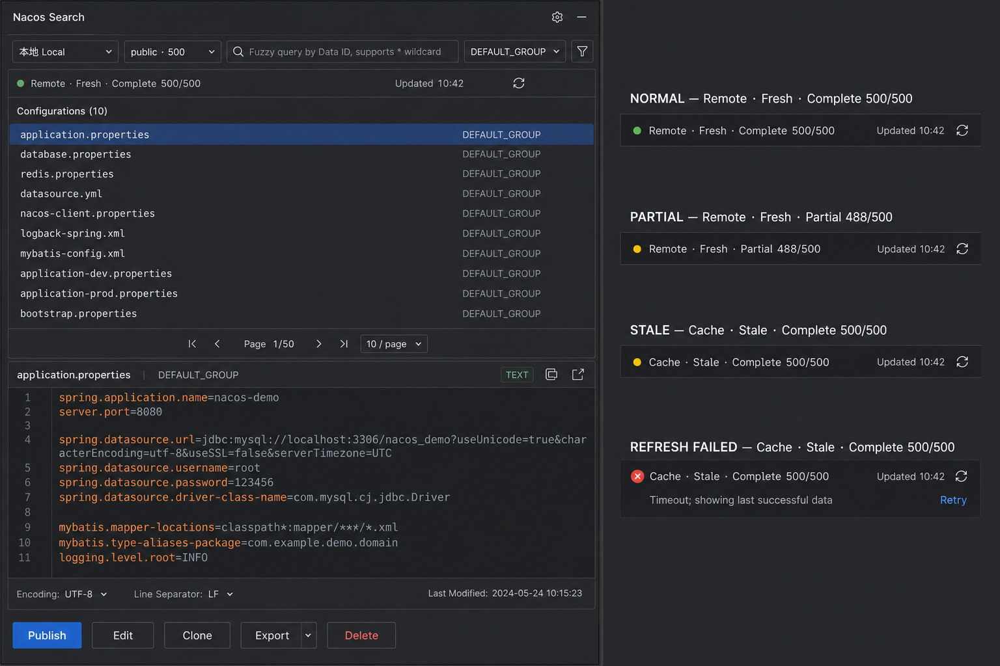
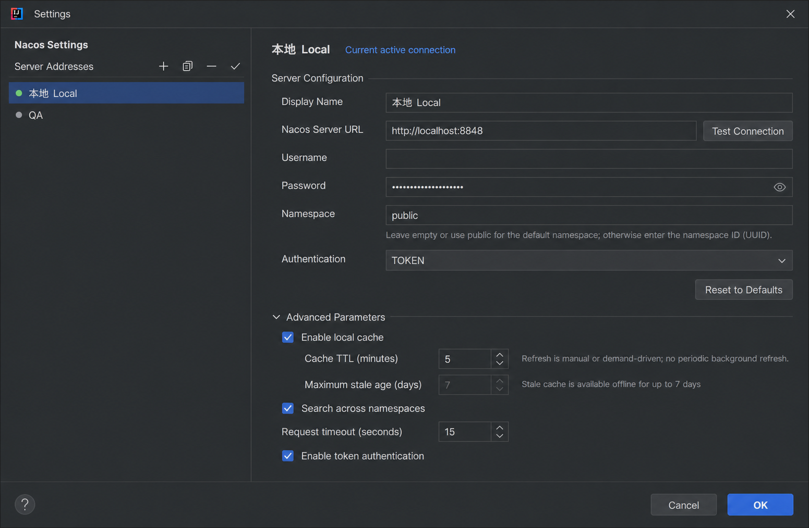

# Nacos Search

在 IntelliJ IDEA 里搜索、查看和定位 Nacos 配置，不必在 IDE 与 Nacos 控制台之间反复切换。

Nacos Search 支持管理多个 Nacos 环境，通过命名空间、Data ID、Group 和配置内容快速检索配置；同时将 Java 代码中的 `@NacosValue` / Spring `@Value` 占位符与 Nacos 配置键关联起来，提供 gutter 图标跳转、反向查找引用和源码用量导航。



## 主要功能

### 在 IDE 中检索 Nacos 配置

- 在右侧工具窗口中浏览配置列表和完整配置内容。
- 支持按 Data ID、Group、配置内容组合搜索。
- 支持精确、模糊和通配符搜索，例如 `application`、`application*`、`*database`。
- 支持命名空间选择、命名空间模糊过滤、Group 过滤与分页浏览。
- 展示 Data ID、Group、Namespace、配置类型和更新时间等信息。
- 支持中英文界面。

### 多环境与认证

- 在一个设置页中维护 Local、Test、Staging、Prod 等多个 Nacos 服务。
- 从工具窗口快速切换当前环境，环境与命名空间加载会绑定到发起请求时的服务器，避免切换过程中混入旧结果。
- 支持 `TOKEN`、`BASIC` 和 `HYBRID` 三种认证方式。
- 密码存储在 IntelliJ Platform PasswordSafe 中，不会以明文写入插件设置 XML。
- 可按环境设置默认命名空间、默认 Group、连接超时以及是否允许跨命名空间导航。

### 代码与配置双向导航

插件识别 Java 代码中 `@NacosValue` 和 Spring `@Value` 里的 `${key}`、`${key:default}` 占位符：

- gutter 图标显示配置键是否已解析，并可直接打开对应的 Nacos 配置。
- 同一个键存在多个候选配置时，提供带命名空间和来源信息的选择列表。
- 在配置键上使用 **Find Usages**，可反向查找项目内的 Java 引用。
- 在配置详情中查看代码用量并跳转到源码位置。
- 支持 Properties、YAML/YML 和 JSON 配置键解析，包括单行压缩 JSON。
- 持久化占位符索引，加速反向查找；1.3.4 会自动重建旧格式索引。

### 缓存与稳定性

- 配置数据按“服务器 + 访问身份 + 命名空间”隔离，防止不同环境或账号共享错误数据。
- 大体积配置使用按条目文件持久化，后台加载，不阻塞 IDE 启动。
- namespace 索引刷新由统一协调器合并，避免重复加载和旧请求覆盖新状态。
- 网络请求采用有界、可取消的超时与重试策略。
- 单条配置内容并发拉取，上限为 8，缩短大型命名空间的加载时间。
- 刷新失败时可保留有限期内的旧缓存，并在界面明确展示当前数据来源与状态。
- 支持手动刷新和清空缓存；插件不执行周期性自动刷新。

## 界面预览

### 工具窗口



### 多环境设置



## 安装

### 从 JetBrains Marketplace 安装

1. 打开 IntelliJ IDEA 的 `Settings/Preferences`。
2. 进入 `Plugins > Marketplace`。
3. 搜索 **Nacos Search**，安装后按提示重启 IDE。

### 从本地安装

使用 Java 17 构建插件：

```bash
export JAVA_HOME=/Library/Java/JavaVirtualMachines/zulu-17.jdk/Contents/Home
./gradlew buildPlugin
```

构建产物位于 `build/distributions/`。在 IntelliJ IDEA 中选择 `Plugins > ⚙ > Install Plugin from Disk...` 并选中生成的 ZIP 文件。

## 快速开始

### 1. 添加 Nacos 环境

打开 `Settings/Preferences > Tools > Nacos Search`，添加或编辑服务配置：

| 配置项 | 说明 |
| --- | --- |
| Display Name | 环境显示名称，例如 `Local`、`Test`、`Prod` |
| Nacos Server URL | Nacos 地址，例如 `http://localhost:8848` |
| Username / Password | Nacos 账号和密码；无认证服务可以留空 |
| Namespace | 默认命名空间；公开命名空间通常使用 `public` |
| Default Group | 默认分组，通常为 `DEFAULT_GROUP` |
| Authentication | `TOKEN`、`BASIC` 或 `HYBRID` |
| Connection Timeout | 当前环境的连接超时时间 |
| Cross-namespace navigation | 是否允许代码导航匹配其他命名空间中的配置 |

保存设置后，插件会测试连接并加载当前环境的数据。

### 2. 打开工具窗口

通过 `View > Tool Windows > Nacos Search` 打开工具窗口。顶部环境名称用于切换 Nacos 服务，命名空间选择器用于切换和过滤 namespace。

### 3. 搜索配置

基础搜索可直接输入 Data ID。展开高级条件后，可以分别填写 Data ID、Group 和配置内容，也可以使用 Group 过滤器缩小结果范围。

搜索示例：

```text
application
application*
*database
```

选择结果后即可查看完整内容和元信息。工具栏提供刷新与清空操作；同样的操作也注册在 IDEA 的 `Tools` 菜单中。

### 4. 从代码跳转到配置

在 Java 项目中使用受支持的注解：

```java
@NacosValue(value = "${order.timeout:3000}", autoRefreshed = true)
private long orderTimeout;

@Value("${feature.payment.enabled:false}")
private boolean paymentEnabled;
```

当对应命名空间缓存已加载后，编辑器 gutter 会显示解析状态。点击图标即可打开配置；从目标配置键执行 **Find Usages** 可以查找项目中的占位符引用。

## 兼容性

| 项目 | 版本 |
| --- | --- |
| 插件版本 | `1.3.5` |
| IntelliJ IDEA | `2024.3`（build 243）至 `2026.1`（build 261.*） |
| Java / Gradle Toolchain | Java 17 |
| Kotlin | 2.0.21 |
| Gradle | 9.0.0 |

代码导航依赖 IntelliJ Java 插件，目前仅为 Java PSI 注册；Nacos 配置搜索与查看功能不受此限制。

## 开发指南

仓库使用 Gradle Wrapper，所有构建命令均在项目根目录执行：

```bash
# 编译主代码和测试代码
./gradlew compileKotlin compileTestKotlin

# 运行全部测试
./gradlew test

# 启动加载了插件的开发版 IDEA
./gradlew runIde

# 构建可安装插件
./gradlew buildPlugin

# 对配置的 IDEA 版本执行插件兼容性校验
./gradlew verifyPlugin
```

运行单个测试：

```bash
./gradlew test --tests "com.nanyin.nacos.search.services.NacosApiServiceTest"
```

主要源码目录：

```text
src/main/kotlin/com/nanyin/nacos/search/
├── actions/      IDEA 菜单与工具动作
├── managers/     初始化与生命周期管理
├── models/       服务、配置、搜索及加载结果模型
├── psi/          占位符索引、代码导航与 Find Usages
├── services/     Nacos API、认证、搜索、缓存与刷新协调
├── settings/     持久化设置、PasswordSafe 与设置页
└── ui/           工具窗口及 Swing UI 组件
```

构建平台为 IntelliJ IDEA Community `2024.3.5`。插件验证还覆盖 `2025.1` 和 `2026.1 EAP`。签名与发布分别通过 `PRIVATE_KEY`、`CERTIFICATE_CHAIN`、`PRIVATE_KEY_PASSWORD` 和 `PUBLISH_TOKEN` 环境变量配置；未提供签名凭据时会自动跳过签名任务。

## 许可证

本项目基于 [MIT License](LICENSE) 开源。
